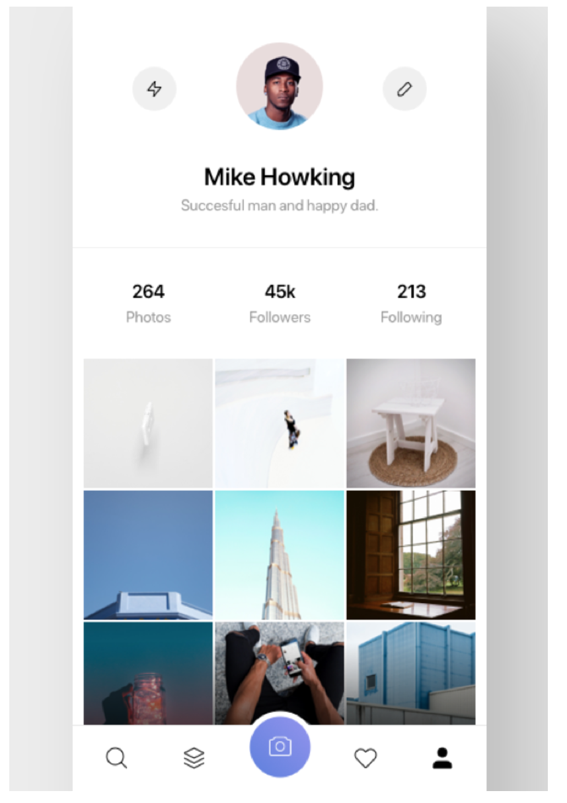

`Desarrollo Mobile` > `Swift Avanzado`

## Comenzando el Proyecto

### OBJETIVO 

- Crear la base del proyecto de este módulo.

#### REQUISITOS 

1. Xcode 11

#### DESARROLLO

Implementar una App, que tenga una distribución de elementos similar a esta vista.

Los botones deben tener un Enum para saber que tipo son.

Interfaz sugerida:

Los componentes a implementar son:

- CollectionView con un custom cell que tenga un UIImageView para poder mostrar fotos.
- Un subview con dos Labels.
- UIButton redondeado
- UIImageView redondeado
- Todo en el ViewController principal.