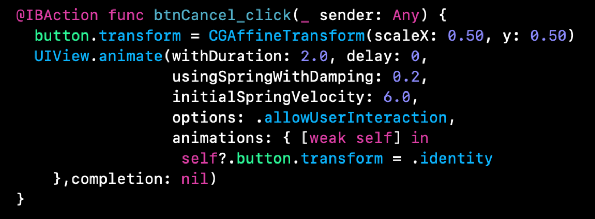

`Desarrollo Mobile` > `Swift Avanzado`


## Migración de código a Extensions

### OBJETIVO

- Migrar el código mostrado hacia protocolos, Extensions y clases utilizando `where Self`.

#### REQUISITOS

1. Xcode 11

#### DESARROLLO

Dado el siguiente código, crear el `Protocol` y extensión para que el `UIButton` funcione de la misma manera.



1.- Comenzaremos creando un protocolo para indicar que el button tendra un efecto cuando lo presionemos:

```
protocol Jump {
  func jump()
}
```

2.- Con un extension agregaremos la animación.

```
extension Jump where Self: UIButton {
  func jump() {
  	// code...
  }
}
```

3.- Ya que `Self` apunta a `UIButton`, entonces `Self` es una referencia directa al `UIButton`, tenemos sus propiedades y funciones.

```
self.transform = CGAffineTransform(scaleX: 0.50, y: 0.50)
```

Y para la animación:

```
UIView.animate(withDuration: 2.0,
                   delay: 0,
                   usingSpringWithDamping: 0.2,
                   initialSpringVelocity: 6.0,
                   options: .allowUserInteraction,
                   animations: { [weak self] in
                    self?.transform = .identity},completion: nil)
```

4.- Finalmente la clase del UIButton conformará el protocolo `Jump`.

```
public class JumpButton: UIButton, Jump {
	// ...
}
```
 