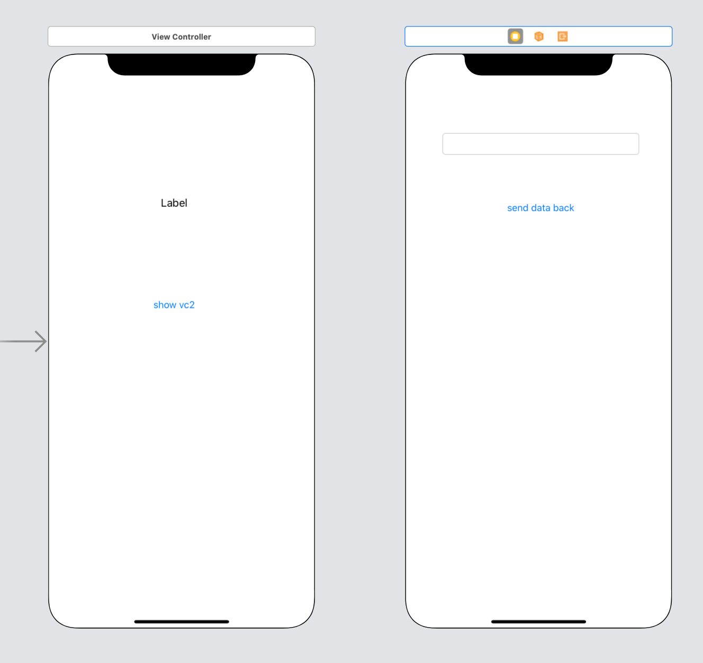

`Desarrollo Mobile` > `Swift Avanzado`


## Patrón Delegate

### OBJETIVO

-  Implementar el patrón delegate.

#### REQUISITOS

1. Xcode 11

#### DESARROLLO

Implementar el Patrón Delegate.

1.- Crear una App donde el `ViewController-A` envíe eventos al `ViewController-B` y este a su vez envíe eventos de regreso al `ViewController-A`.

2.- Creamos la sig. interfaz. Dos `ViewControllers`, el primero con un Label y Button y el segundo con un TextField y Button.



3.- Crearemos el protocolo de comunicación:

```
protocol Message {
  func message(_ text: String)
}
```

4.- En la clase que conforma dicho protocolo, implementamos la función:

```
extension ViewController: Message {
  func message(_ text: String) {
    self.label.text = text
  }
}
```

5.- La instancia del VC debe utilizar la variable self para hacer el enlace con el VCB.

```
 vc.delegatMessage = self
```

**El código:
**
```
import UIKit

protocol Message {
  func message(_ text: String)
}

class ViewController: UIViewController {
  
  @IBOutlet weak var label: UILabel!
  
  override func viewDidLoad() {
    super.viewDidLoad()
    // Do any additional setup after loading the view.
  }
  
  @IBAction func goToVC2(_ sender: Any) {
    if let vc = UIStoryboard(name: "Main", bundle: nil).instantiateViewController(withIdentifier: "ViewControllerB") as? ViewControllerB {
      vc.delegatMessage = self
      present(vc, animated: true, completion: nil)
    }
  }
  
}
extension ViewController: Message {
  func message(_ text: String) {
    self.label.text = text
  }
}
```

6.- En el ViewControllerB, crearemos una variable llamada `delegate`.

```
  var delegatMessage: Message?
```

7.- Enviaremos la data de regreso al ViewController principal.

```
 @IBAction func gotBack(_ sender: Any) {
    guard let text = textField.text else { return }
    delegatMessage?.message(text)
    dismiss(animated: true, completion: nil)
  }
```


