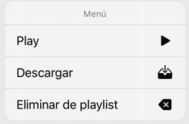

`Desarrollo Mobile` > `Swift Avanzado`

## App

#### REQUISITOS

1. Proyecto del Reto-03 de la Sesión-01 terminado.
2. Proyecto del Reto-03 de la Sesión-02 terminado.
3. Xcode 11

### OBJETIVO
Crear la estructura básica para la implementación de las clases para el reproductor de música.
Emplear los temas desarrollados en las sesiones correspondientes a protocolos con extensiones desarrollando nuevas funcionalidades para la app del reproductor de música. 
Implementar el uso de MVVM en nuestro proyecto.

#### DESARROLLO
Con base en la aplicación que has ido desarrollando a lo largo del curso crearás los archivos Models y ViewModels para los elementos necesarios con el objetivo de validar lo aprendido y crear el funcionamiento de los siguientes puntos:

Crear estructura de nuestros objetos para ser los DTO (Data Transfer Object) que se usarán en el ViewModel, estos DTO deberán corresponder a las opciones trabajadas en la Sesión 1, las opciones que debes contemplar son Nombre, Artista, Imagen.
 Crear un boton que nos lleve al listado de canciones.
 Crea un ViewController donde podrás incorporar el listado de canciones añadidas, como ejemplo puedes guiarte de la imagen siguiente:

 Crear elementos de tabla para el manejo del ViewModel de las celdas, puedes hacer uso del video que viene en el material de esta sesión.
  Agregar opciones para:

 - Comenzar a tocar (Play)
 - Descarga
 - Eliminar de playlist

 
 Funcionalidad para las opciones del menú:

 - Play, deberá a comenzar a tocar la canción, en este momento solo mandar un alert que diga que se comenzará a tocar la canción.
 - Descarga, solo mostrará un “alert” con los datos de la canción a descargar, pero al hacerlo una vez desaparece esta opción del menú.
 - Eliminar de playlist, permitirá quitarla del arreglo de objetos o elementos con el que se trabaje. En este momento solo mandara el alert de la accion a realizar
 
 

 

 

Deberas usar codigo reutilizable por lo que evita generar codigo "basura", esto aplica al codigo anterior generado

