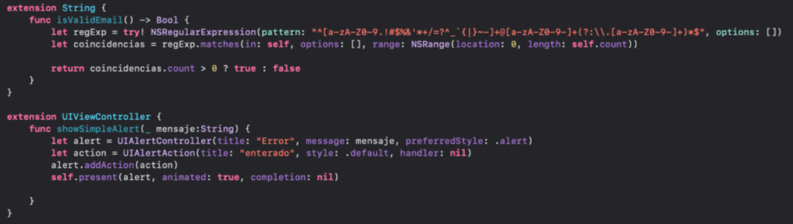

`Desarrollo Mobile` > `Swift Avanzado`

## Protocolos y delegados

### OBJETIVO

- Construir la adaptación al modelo MVVM.
- Emplear los temas desarrollados en las sesiones correspondientes a patrones y delegados.
- Implementar protocolos como una mejor práctica de desarrollo y aprovechando el potencial de Swift.

#### REQUISITOS

1. Xcode 12.5.1 

#### DESARROLLO

**Desarrollar**:

Desarrollo
Con base en lo aprendido, deberás continuar el pase del modelo MVC a MVVM, mejorando el código al implementar extensiones para los elementos que se puedan repetir como:
Alertas simples 
Validación de correo

Al tener código repetido podrás hacer uso de las buenas prácticas para utilizarlo, lo cual se hace de la siguiente manera:

Con estas extensiones, si quieres validar algún texto se coloca de la siguiente forma:

username.isValidEmail()

Donde username es un texto, la función regresa un Bool lo que te ayudará en las validaciones, mismas que de haber un error podrás invocar un alert aprovechando la función creada en la extensión,de la siguiente manera:

self.showSimpleAlert(“Mensaje de error”)

Aquí siempre lo invocas con self desde un viewController, ya que se marca esta función desde una extensión de UIViewController.
