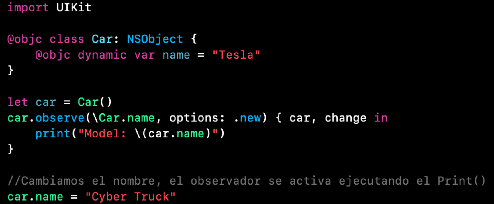

`Desarrollo Mobile` > `Swift Avanzado`

## KVO

### OBJETIVO

- Introducir al concepto de KVO.

#### REQUISITOS

1. Xcode 11
2. Playgrounds

#### DESARROLLO

- Implementaremos un Observador mediante KVO.

En un nuevo playground Implementar lo siguiente:
Comenzamos creando una clase que herede de NSObject.
Es necesario este paso ya que KVO funciona bajo Objective-C, precisamente con el `Dynamic Dispatch` de Objective-C.

```
class Car: NSObject {

}
```

Para poder hacer uso efectivo de KVO, es necesaria la palabra reservada `@objc`.

```
@objc class Car: NSObject {

}
```

Comenzamos haciendo un observador en un property, por consiguiente volvemos a utilizar la palabra `@objc`.

```
@objc class Car: NSObject {
	@objc dynamic var name = "Tesla"
}
```

Creamos una instancia de la clase.

```
let car = Car()
```

A dicha instancia, agregamos un observador y especificamos el property a observar, aqui tendremos dos variables en el closure.

```
car.observe(\Car.name, options: .new) { car, change in 
	print("Model: \(car.name)")
}
```

Hacemos una prueba, al cambiar el valor de la variable se debe disparar el observador.

```
car.name = "Cyber truck"
```

El codigo final:



