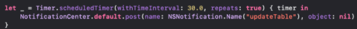

`Desarrollo Mobile` > `Swift Avanzado`

## App

### OBJETIVO

Implementar el uso de notifications/observers en el proyecto de la App.
Crear capas con viewmodel, models y view en la app.

#### REQUISITOS

1. último codigo del proyecto.
2. Xcode 11

#### Desarrollo
El proyecto debe tener las siguientes capas:

ViewModel
Models
View

Para ello, toma en cuenta las siguientes instrucciones:
Al no contar con servicios, implementarás un Timer el cual deberá ser repetitivo en intervalos de 30 segundos.

Al pasar los 30 segundos agrega un elemento a “mi lista” y refresca la tabla.

Recuerda que inicialmente tienes que suscribir tu observador, para ello,  la  forma de hacerlo es la siguiente:

Con esto deberás crear el evento en donde se estará agregando un elemento a tu objeto para mandar hacer un reloadData a tu tabla.

Se usará un timer para hacer la solicitud cada 30 segundo; para ello lo crearás de la siguiente forma:

Hasta este punto podrás notar que estás invocando la solicitud al observador, mismo que podría venir desde otro lado de la app como en el AppDelegate al recibir una notificación push.
