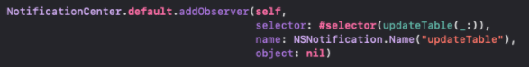

`Desarrollo Mobile` > `Swift Avanzado`

## App

### OBJETIVO

- Implementar el uso de notifications/observers en el proyecto de la App

#### REQUISITOS

1. último codigo del proyecto.
2. Xcode 11

#### DESARROLLO

El proyecto debe tener las siguientes capas:

- ViewModel
- Models
- View

1.- A la vista principal agregar Una función Generica que funcione para mostrar información en el recuadro rojo. Los valores a tratar son `Int` y `String`.

2.- Al presionar el botón de Camara, ir a una segunda vista. Al regresar a la vista principal, la imágen de profile debe agregarse un Circulo de borde de color. Usar solo un color solido. Usar Notifications. Ejemplo:

