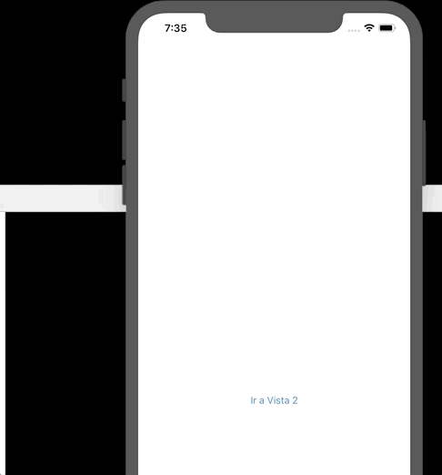

`Desarrollo Mobile` > `Swift Avanzado`
	
## Implementación de Notification

### OBJETIVO 

- Crear una app básica que envíe un notification via Post.

#### REQUISITOS 

1. Xcode 11

#### DESARROLLO

Crear una App con dos `ViewControllers`.

En el **VC1**, crearemos el algoritmo para registrar el **Notification**.

Se observará cuando el **VC2** aparece, entonces mostraremos en consola un mensaje.

Al mostrarse la segunda vista, en el `viewDidLoad()` enviar el post hacia el NotificationCenter.

En el **VC2** agregamos un `deinit{}`, dentro de este un print para asegurar que se ejecuta la destrucció de la Notification.

<details>
	<summary>Solución</summary>
<p>Declaramos un id que servirá para identificar a nuestra notificación.</p>

```
  let bedu = "com.app.bedu"
```

<p>Creamos dos ViewControllers en el Storyboard. Por medio de un UIButton navegaremos hacia el segundo VC2.</p>



<p> Creamos una función que será agregada al Notification.</p>

```
@objc func methodOfReceivedNotification(notification: Notification) {
    // Take Action on Notification
    print("Hola")
}
```

<p> Creamos el Notification, pasándole como parámetro la función.</p>
	
```
NotificationCenter.default.addObserver(self, selector: #selector(methodOfReceivedNotification(notification:)),
                                           name: Notification.Name(bedu),
                                           object: nil)
```	
<p> En el VC2 creamos el POST del notification en el ViewDidload()</p>

```
override func viewDidAppear(_ animated: Bool) {
    super.viewDidAppear(animated)
    NotificationCenter.default.post(name: Notification.Name(bedu), object: nil)
  }
```

<p> Removemos dicha notificación al salir del VC2.</p>

```
  // Remove notification
  deinit {
    print("bye")
    NotificationCenter.default.removeObserver(self, name: Notification.Name(bedu), object: nil)
  }
```

</details> 

