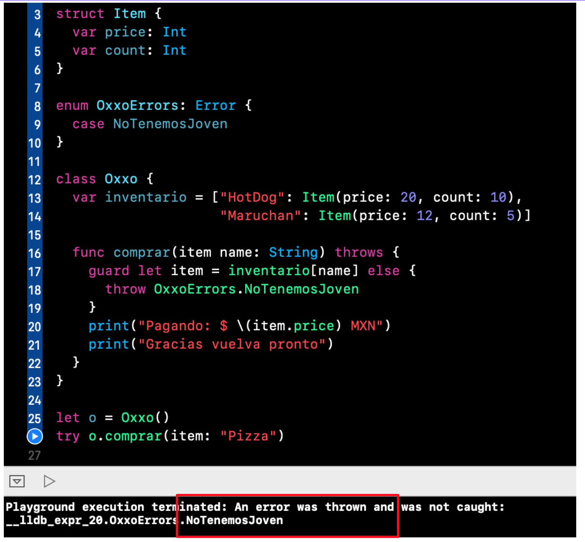

`Desarrollo Mobile` > `Swift Avanzado`

## Uso basico de los hilos

### OBJETIVO

- Implementar el manejo de hilos para multiples actividades

#### REQUISITOS

1. Xcode 11

#### DESARROLLO

Implementaremos multiples hilos disparados por medio de un botón.

Imprimiremos el resultado en consola para entender su uso.

```
enum OxxoErrors: Error {
  case NoTenemosJoven
}
```


El codigo final y output:


  
  
