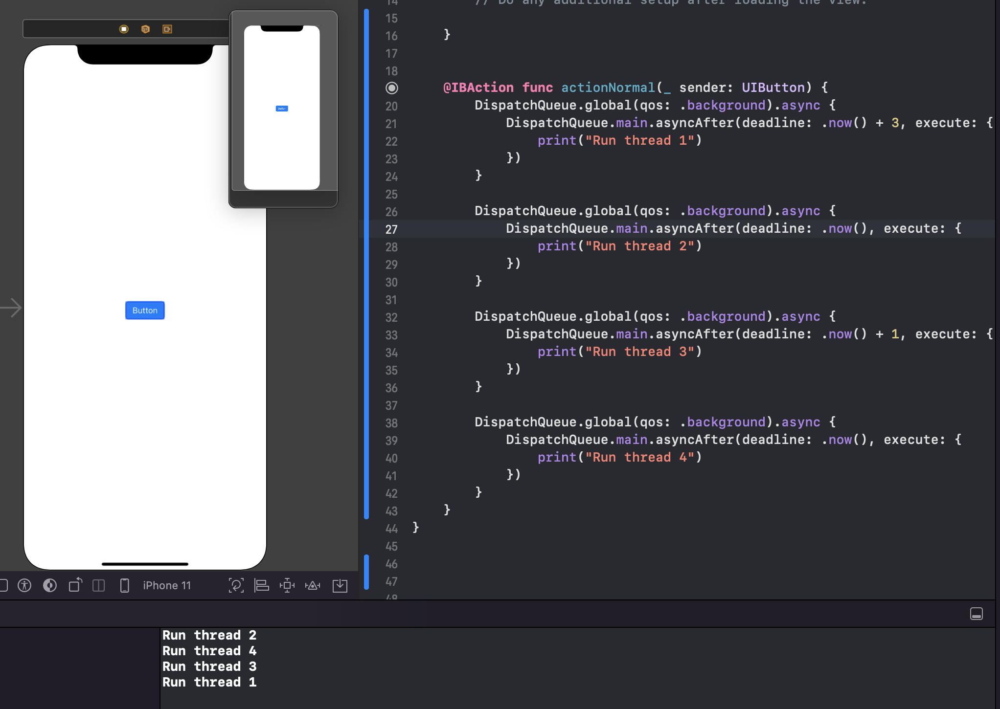

`Desarrollo Mobile` > `Swift Avanzado`

## Uso basico de los hilos

### OBJETIVO

- Implementar el manejo de hilos para multiples actividades

#### REQUISITOS

1. Xcode 11

#### DESARROLLO

Implementaremos multiples hilos disparados por medio de un botón.

Imprimiremos el resultado en consola para entender su uso.

```
@IBAction func actionNormal(_ sender: UIButton) {
        DispatchQueue.global(qos: .background).async {
            DispatchQueue.main.asyncAfter(deadline: .now() + 3, execute: {
                print("Run thread 1")
            })
        }
        
        DispatchQueue.global(qos: .background).async {
            DispatchQueue.main.asyncAfter(deadline: .now(), execute: {
                print("Run thread 2")
            })
        }
        
        DispatchQueue.global(qos: .background).async {
            DispatchQueue.main.asyncAfter(deadline: .now() + 1, execute: {
                print("Run thread 3")
            })
        }
        
        DispatchQueue.global(qos: .background).async {
            DispatchQueue.main.asyncAfter(deadline: .now(), execute: {
                print("Run thread 4")
            })
        }
    }
```

Vemos que estamos disparando el evento con diferencia de tiempo

El codigo final y output:


  
  
