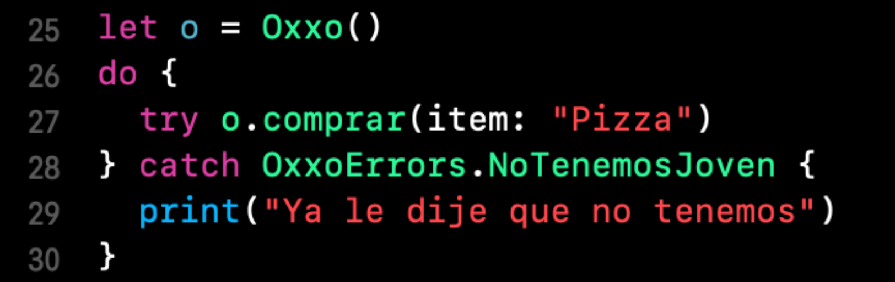

`Desarrollo Mobile` > `Swift Avanzado`

## Catching errors

### OBJETIVO

- Implementar una estructura do-catch para manejar el error definido.

#### REQUISITOS

1. Xcode 11
2. Playgrounds

#### DESARROLLO

Implementación de la clase del `Ejemplo-01` con: 

`try!` y `try?`

Manejar el error con `do-catch`.

Para poder manejar `try` sin ningún operador adicional tales como `!` o `?` es necesario utilizar la estructura `do-catch`.

despues de `do {` agregamos el código que es potencialmente susceptible a errores.

Dicho esto, podemos utilizar la palabra `try`.

Finalmente en la parte del `catch` podemos dejarlo simplemente como es o agregar un error. En caso de agegar un error solo entrará a ese bloque de código si y solo si ese error ocurre, de lo contrario es ignorado.

