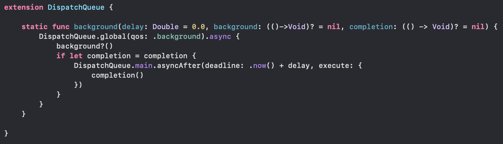
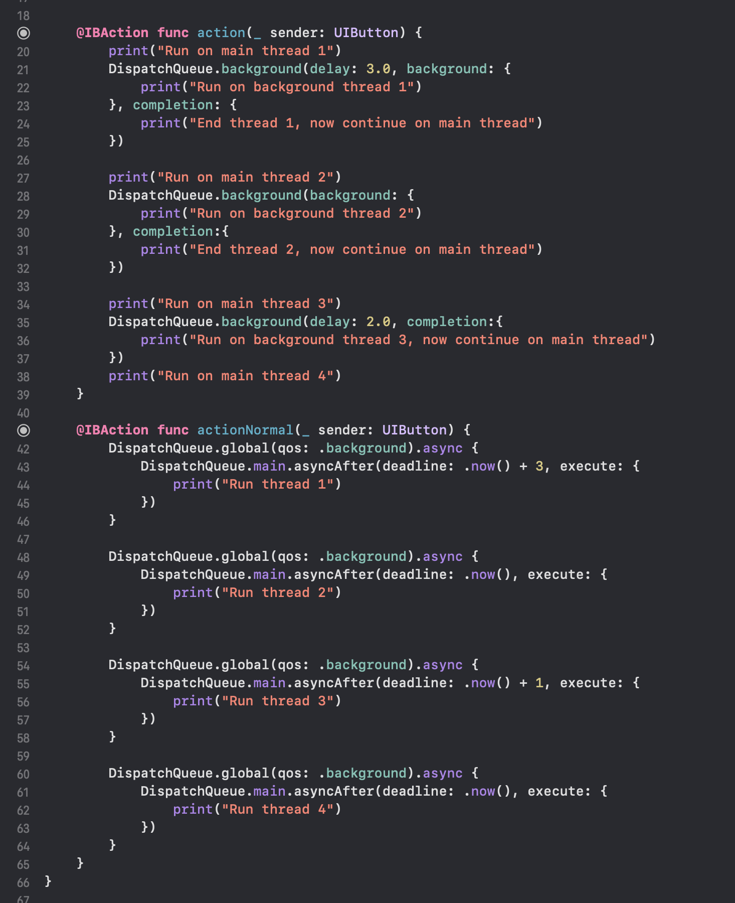

`Desarrollo Mobile` > `Swift Avanzado`


## Extensión para uso de hilos

### OBJETIVO

- Multiples hilos con funcion generica

#### REQUISITOS

1. Xcode 11


#### DESARROLLO

Implementación de la clase del `Ejemplo-01` con multiples hilos

Generamos la extension de `DispatchQueue`

```
extension DispatchQueue {

    static func background(delay: Double = 0.0, background: (()->Void)? = nil, completion: (() -> Void)? = nil) {
        DispatchQueue.global(qos: .background).async {
            background?()
            if let completion = completion {
                DispatchQueue.main.asyncAfter(deadline: .now() + delay, execute: {
                    completion()
                })
            }
        }
    }

}

```

Aplicamos una accion al terminar la tarea que se haya programado y se pinta en consola


Veamos el código final



