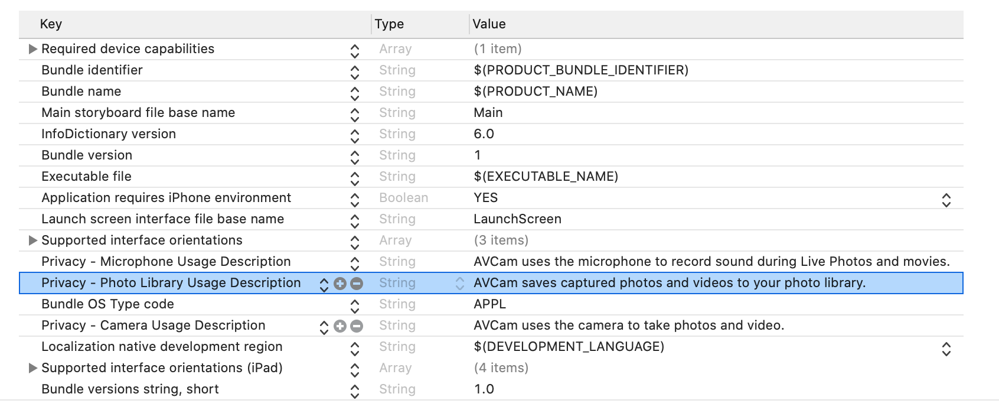

`Desarrollo Mobile` > `Swift Avanzado`

## Fotos con AVCaptureSession

### OBJETIVO

- Implementar una app con los pasos de AVCaptureSession.

#### REQUISITOS

1. Xcode 11
2. iPhone con iOS 13
3. Cable Lightning original

#### DESARROLLO

0.- Al crear el proyecto, establecer permisos de uso de Camara:



Creamos una clase llamada PreviewView que herede de UIView. Esta servirá para mostrar lo que la cámara ve.

```
import UIKit
import AVFoundation

class PreviewView: UIView {
  var videoPreviewLayer: AVCaptureVideoPreviewLayer {
    guard let layer = layer as? AVCaptureVideoPreviewLayer else {
      fatalError("Expected `AVCaptureVideoPreviewLayer` type for layer. Check PreviewView.layerClass implementation.")
    }
    
    return layer
  }
  
  var session: AVCaptureSession? {
    get {
      return videoPreviewLayer.session
    }
    set {
      videoPreviewLayer.session = newValue
    }
  }
  
  // MARK: UIView
  
  override class var layerClass: AnyClass {
    return AVCaptureVideoPreviewLayer.self
  }
}
```

En el ViewController tendremos una instancia de dicha clase:

```
  @IBOutlet private weak var previewView: PreviewView!
```

1.- Creamos una session con `AVCaptureSession()`.

```
  private let session = AVCaptureSession()
```

2.- Creamos una instancia de `AVCapturePhotoOutput()`.

```
  private let photoOutput = AVCapturePhotoOutput()
```

3.- Agregamos a la sesión el output mediante la función `addOutput()`.

4.- Creamos un commit de la sesión mediante `commitConfiguration()`.

```
private func configureSession() {
    session.beginConfiguration()
    
    // Add video input.
    do {
      let videoDevice = AVCaptureDevice.default(.builtInWideAngleCamera, for: .video, position: .front)
      let videoDeviceInput = try AVCaptureDeviceInput(device: videoDevice!)
      session.addInput(videoDeviceInput)
    }
    catch {
      print("Couldn't create video device input: \(error)")
      session.commitConfiguration()
      return
    }
    
    // Add photo output.
    session.addOutput(photoOutput)
    session.commitConfiguration()
  }
```

5.- La acción de tomar foto se ejecuta en un `DispatchQueue`.

```
   self.sessionQueue.async {
      self.photoOutput.capturePhoto(with: AVCapturePhotoSettings(), delegate: self)
    }
```

6.- Por último, la foto tomada será recibida como tipo Data en funciones `Delegate`.

```
extension ViewController: AVCapturePhotoCaptureDelegate{
  func photoOutput(_ output: AVCapturePhotoOutput, didFinishProcessingPhoto photo: AVCapturePhoto, error: Error?) {
    if let error = error {
      print("Error capturing photo: \(error)")
    } else {
      photoData = photo.fileDataRepresentation()
    }
  }
```


