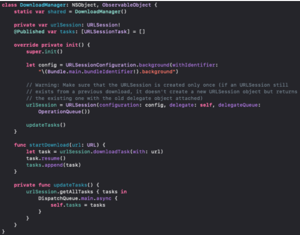

`Desarrollo Mobile` > `Swift Avanzado`

## Descarga en segundo plano

### OBJETIVO

Demostrar el porcentaje de descarga de un archivo de prueba.

#### REQUISITOS

1. Xcode 11
2. Proyecto de App terminado del Reto-03 de esta sesión.

#### Desarrollo
Crea un DownloadManager. 
Crea una variable Shared para su fácil acceso. 
Descarga un archivo demo desde "https://speed.hetzner.de/100MB.bin" que es un archivo de prueba. 
Mostrar en consola el % de descarga

El Manager lo tendrás de la siguiente manera:

Para su funcionamiento podrás implementar también una extensión quedando de esta forma:

Recuerda que para poder invocar el shared lo podrás hacer de esta forma:

DownloadManager.shared.startDownload(url: URL(string: "https://speed.hetzner.de/100MB.bin")!)
