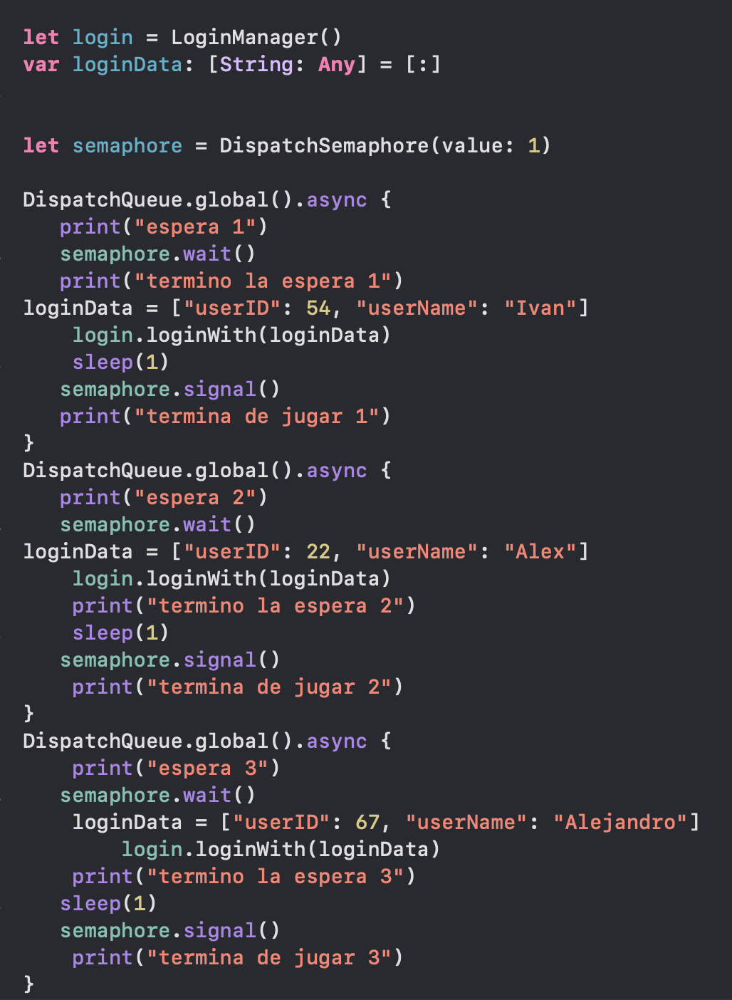

 
`Desarrollo Mobile` > `Swift Avanzado`

## Eventos y semaforo

### OBJETIVO 

- Integrar el código del Ejemplo-01 de la Sesión 3 con el semáforo.

#### REQUISITOS 

1. Xcode 11
2. Ejemplo-01 de la sesión 3

#### DESARROLLO

Una vez aprendido el uso de notificaciones y tener conocimiento del semaforo, integraremos ambos en un mismo reto
Usando el mismo codigo anterior, dispararemos distintos logueos por medio del semaforo tomando como referencia el ejemplo de los niños que quieren usar el ipad

	
Solucion

	
 La solución es simple, a nuestro Ejemplo 1 de la sesión 3 aprovecharemos lo ya construido invocando con el semaforo con distintos datos para el logueo

	
Aqui elcodigo nuevo

	
	
	

 
