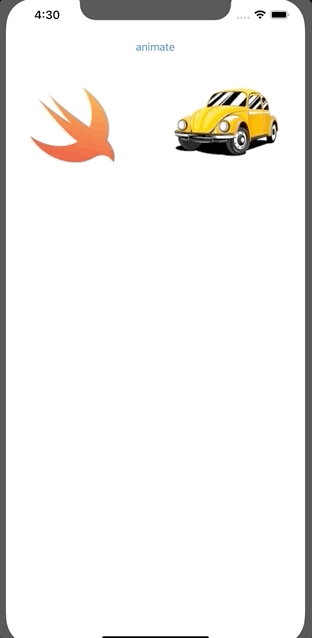

`Desarrollo Mobile` > `Swift Avanzado`

## Implementación de Animations

### OBJETIVO

- Implementación de animaciones basicas de traslación y aumento de tamaño.

#### REQUISITOS

1. Xcode 11

#### DESARROLLO

Implementar una App con dos ImageViews.

Aplicar un Animate closure para hacer diferentes tipos de animaciones como traslación, escalamiento y rotación.



1.- Creamo sun nuevo proyecto con Swift como lenguaje.

2.- Agregamos al Main storyboard dos UIImageViews.

3.- Conectamos con el ViewController los IBOutlets.

4.- Implementamos un bloque de UIView para animations.

```
UIView.animate(withDuration: 2.0, animations: { () -> Void in
      self.image1.center = self.view.center
    })
```
5.- Implementar mas variantes.

6.- Ejecutamos
