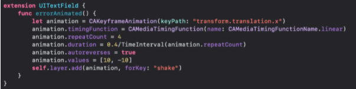
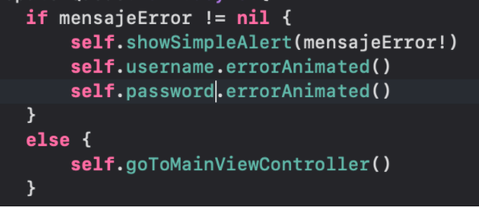

`Desarrollo Mobile` > `Swift Avanzado`

## POSTWORK Manejo de animaciones

### OBJETIVO

Crear animaciones mediante el manejo de extensiones con CoreAnimatio.
Implementar animaciones en los elementos UITextField que no cumplan con los requisitos.

Desarrollo
Crearás una extensión para UITextField. 
Agregarás un método el cual contenga la animación, esta hará referencia a sí mismo por medio de “self”. 
Asignarás esta función al obtener un error en los campos. 

La extensión queda bastante simple, usando el CoreAnimation para lograr un efecto más definido como se muestra a continuación:

La invocación es sumamente fácil, al ser una extensión del UITextField solo queda poner el nombre, buscar la función y dar enter como se muestra:

Esta animación hará un shake durante 4 segundos, suficiente para que se pueda identificar visualmente el error.

Como adicional, se puede manejar una animación con UIKit al momento de iniciar el controlador, esto para que por medio de alpha aparezca, para ello agregarás a tu extensión lo siguiente:

func startInController() {
        self.alpha = 0
        UIView.animate(withDuration: 1, delay: 0.2, animations: {
            self.alpha = 1
        })        
    }

Y al iniciar el controlador invocarás la siguiente función desde tu elemento, resultando algo así:

username.startInController()
