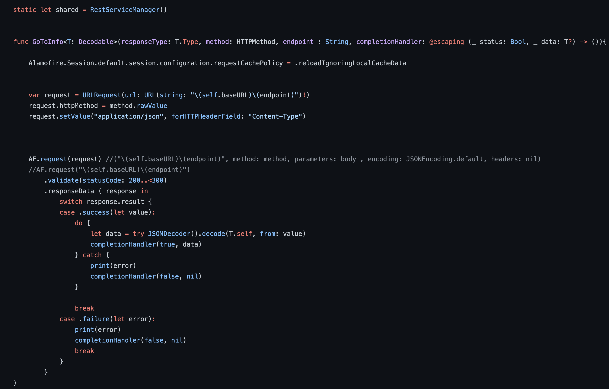

`Desarrollo Mobile` > `Swift Avanzado`

## Instalacion Alamofire

### OBJETIVO

- Consumo de servicio GET con Alamofire.

#### REQUISITOS

1. xCode
2. Instalación de CocoaPods
3. Descarga de Alamofire en el proyecto

#### DESARROLLO

Crea un nuevo proyecto en xCode, con un tipo de vista única.
Instala Alamofire en el proyecto
Crea el manager para el consumo de servicios.
Crea el evento para la solicitud de servicios GET.
Agrega un elemento de tabla en tu vista
Crea una función donde imprimas en pantalla el listado de elementos que regresa el servicio


<details>

Solucion
Una vez instalado Alamofire en el proyecto crearemos nuestro manager y haremos uso del metodo GET de nuestro servicio con la finalidad de mostrar en una tabla los elementos obtenidos
Genera la interfaz donde tendremos nuestra tabla con una celda custom donde mostraremos los datos en pantalla, la selección de momento no tendrá acción
 
Crea tu manager para los llamados al API usando la sintaxis de Alamofire


Tu Manager debe ser algo similr a esto 


En tu clase de la interfaz has el llamado para hacer una consulta simple
```
func getData() {
        RestServiceManager.shared.GoToInfo(responseType: [SongModel].self, method: .get, endpoint: "songs") { status, data in
            if let dataResponse = data {
                self.data = dataResponse
                self.tableView.reloadData()
            }
        }
    }
```
Recuerda que previamente debes haber cargado tus Modelos
 Finalmente coloca la informacion obtenida en la tabla
</details>
