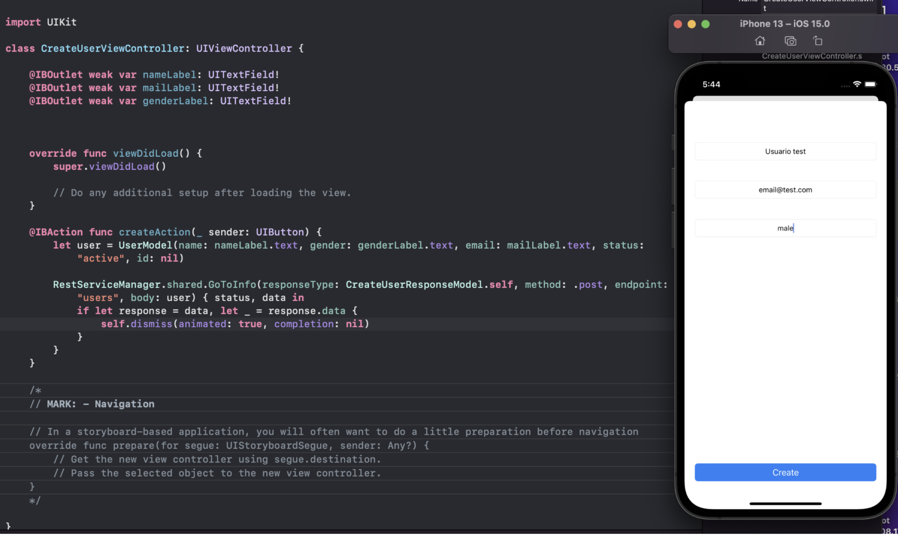

`Desarrollo Mobile` > `Swift Avanzado`

## Preparación para servicios POST

### OBJETIVO

- Usando Alamofire aprenderas al uso de los metodos que requieren un payload (body) como es POST

#### REQUISITOS

1. Ejemplo-01

#### DESARROLLO

Utiliza el proyecto de la actividad 1
Actualiza el manager para agregar un método que acepte un body.
Crea el evento para la solicitud de servicios POST.
Agrega un elemento de tabla en tu vista
Crea una pantalla para agregar el formulario donde solicitaremos la llamada POST
Una vez sea exitoso el llamado, regresaremos a nuestra vista anterior

Para el correco uso necesitamos el endpoint https://gorest.co.in/public/v1/ ya que necesitamos uno donde podamos usar metodos con payload

Solucion
Necesitaras contar con los 2 metodos, uno donde no necesites payload y otro donde si
Crea los modelos necesarios para la construccion partiendo de los que podemos obtener desde la pagina del endpoint
La adaptacion alcodigo debera ser algo asi:
       
        

