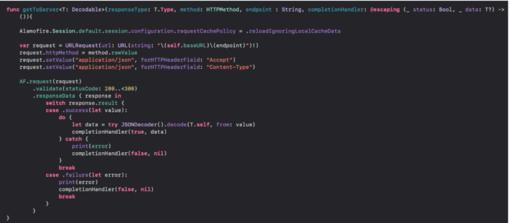
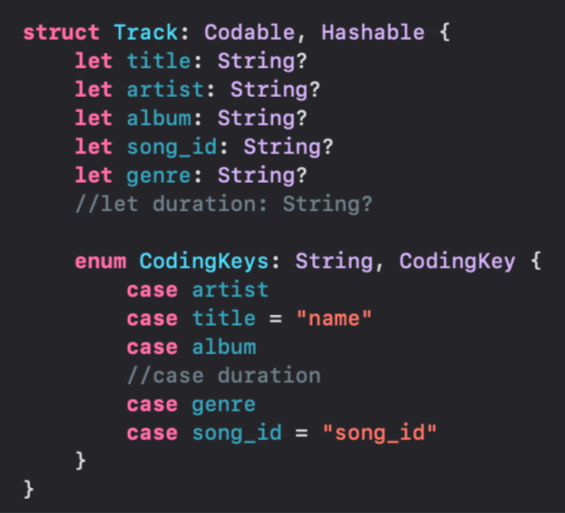

`Desarrollo Mobile` > `Swift Avanzado`

## Consumo de servicios HTTP Rest

### OBJETIVO

Crear el RestServiceManager mediante Alamofire.
Modificar el objeto CODABLE.
Descargar el listado de canciones con un servicio GET.

#### REQUISITOS

1. Xcode 11
2. Proyecto de App que permita tomar fotos.

#### DESARROLLO

Descarga Alamofire por medio de los PODs. 
Crea el RestServiceManager. 
Modifica tu modelo.
Asigna desde el Controlador del listado de canciones la invocación para descargar la lista de canciones. 
Limpia el código.

Recuerda que los elementos PODs que incluimos en el proyecto debe ser instalado por proyecto, para esto en nuestro PODFILE agregaremos:

pod 'Alamofire'
Una vez hecho esto, en la terminal, ubicándonos en la carpeta del proyecto usaremos el comando

$ pod install
Con esto ya tendremos Alamofire instalado y listo para usarse como lo vimos durante la sesión

Continuando con el proceso, nuestro Manager lo tendrás de la siguiente manera:

Recuerda que estarás usando GENERICS para un uso genérico. Por lo que, ya no necesitas continuar con la lista de canciones en tu código, ya que directamente irás al servicio, y tu modelo resultará de la siguiente forma:

Recuerda que tienes tu constante misTracks, esa la cambiarás a una variable asignándole un valor de listado de Tacks vacío, ya que aprovecharás el uso que se le está dando. Finalmente en tu controlador implementarás el llamado al servicio para actualizar tu tabla, viéndose de la siguiente forma:

RestServiceManager.shared.getToServer(responseType: [Track].self, method: .get, endpoint: "songs") { status, data in
            misTracks = [Track]()
            if let _data = data {
                misTracks = _data
                self.tableView.reloadData()
            }
        }
