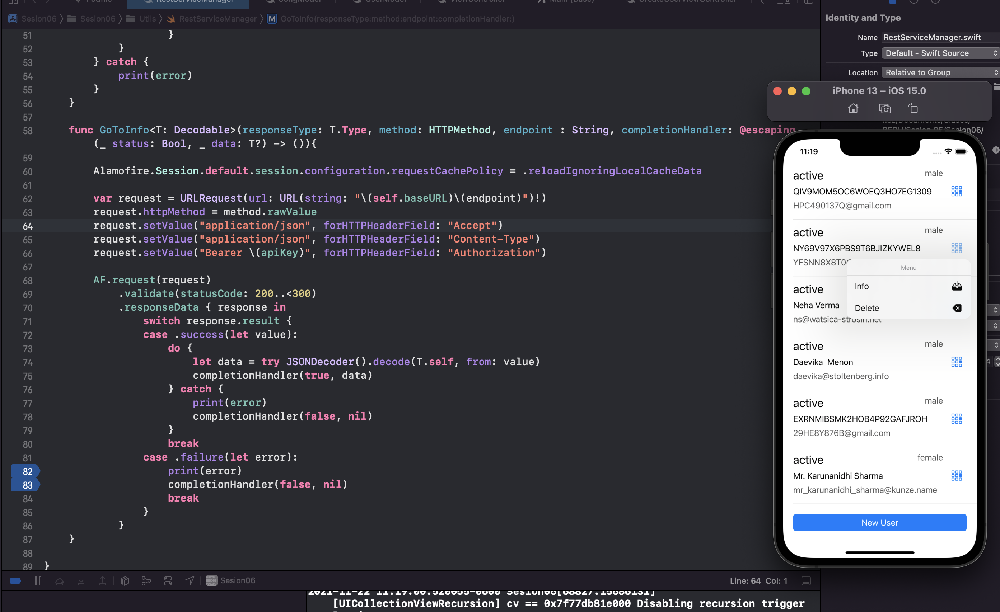

`Desarrollo Mobile` > `Swift Avanzado` 

	
## DELETE con Alamofire 

### OBJETIVO 

- Aplicar los conocimientos adquiridos en la sesión para invocar un metodo DELETE

#### REQUISITOS 

1. Ejercicio-01 y Ejercicio-02
2. xCode 11
3. Cambio de endpoint a los servicios Go Rest

#### DESARROLLO

Aprovechando los avances que tenemos, implementemos accion al seleccionar un elemento
Avisaremos al usuario si quiere ver detalle o eliminar

	Solucion
	
	Mostraremos un menú para dar la opcion de ver el detalle o eliminar
	Al seleccionar eliminar invocar el metodo DELETE con la estructura `/public/v1/users/{ID}`
	Agregaremos tambien la autorizacion al metodo sin payload ya que se requiere para el delete
	

 

 
