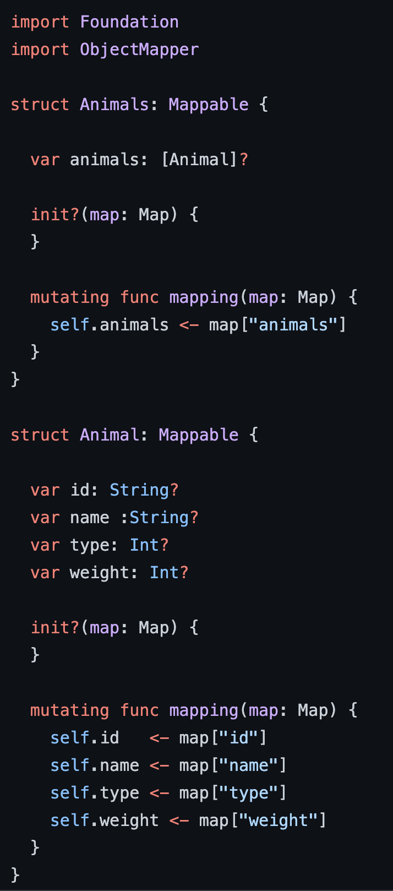
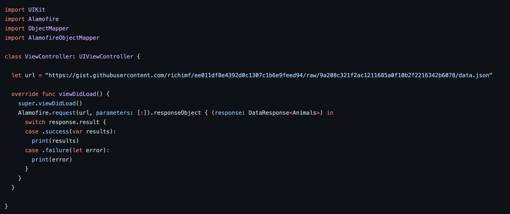

 
`Desarrollo Mobile` > `Swift Avanzado` 

	
## Mapear respuestas con Alamofire 

### OBJETIVO 

- Aplicar los conocimientos adquiridos en la sesión para hacer el mapeo de lo que obtenemos con Alamofire

#### REQUISITOS 

1. Reto-01 y Reto-02
2. xCode 11

#### DESARROLLO

Aprovechando los avances que tenemos, implementaremos la descarga con Alamofire

	Solucion
	
	Implementaremos los DTOs o Modelos a objetos que pueda interpretar correctamente Alamofire, una vez efectuado lo podremos  usar en nuestro proyecto
	
	
	

 

 
 
