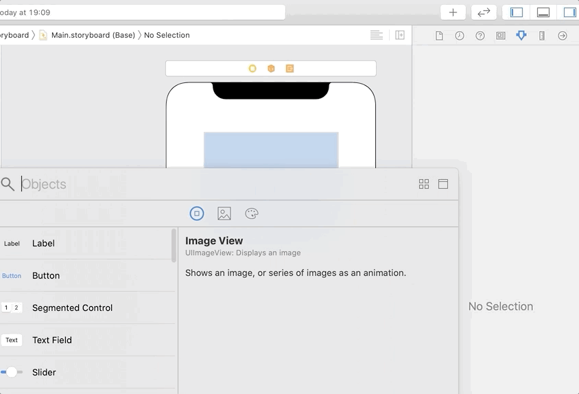

`Desarrollo Mobile` > `Swift Avanzado`

## Gestures, primeros pasos

### OBJETIVO

- Comenzar con la implementación de Gestures.
- Implementación de un PanGesture.

#### REQUISITOS

1. Xcode 11

#### DESARROLLO

1.- Crear un nuevo proyecto en `Xcode`.
2.- Agregaremos un `ImageView` en el `Main.Storyboard`.
3.- Conectamos con el `ViewController` declarando los `IBOutlets` correspondientes.
4.- Abrimos el Library y buscamos *gesture*.
5.- Agregamos el Pan Gesture a cada imagen, arrastrando dicho elemento dentro de cada imagen.

