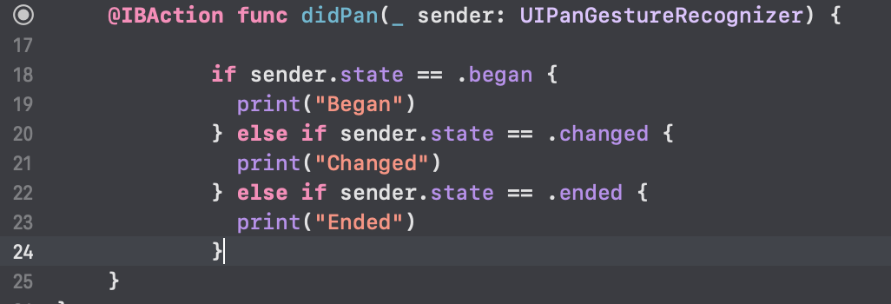

`Desarrollo Mobile` > `Swift Avanzado`

## Programmatic gestures

### OBJETIVO

- Implementar gestures sin necesidad de usar Storyboard.

#### REQUISITOS

1. Xcode 11

#### DESARROLLO

Implementar de manera programática el gesto de Pan.

Basarse en el Ejemplo-01.

Por medio del `sender` obtener el valor del `state` y compararlo con los tres mas importantes como `began` o `ended`.

El IF-ELSE debe implementarse. La idea detrás de esto es “debuggear” los estados, ver como funciona cada uno de ellos al interacturar con los gestures.

