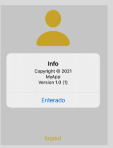

`Desarrollo Mobile` > `Swift Avanzado`

## Postwork

### OBJETIVO

Crear el gesto TAP.
Obtener información de la playlist.
Crear el gesto PINCH.

#### REQUISITOS

1. Xcode 11

#### Desarrollo
En tu pantalla de logout, agrega el gesto TAP sobre la imagen.
Deberás obtener  la información desde la playlist.
Mostrar la información mediante un alert.
Agrega el gesto PINCH sobre la imagen.
Incluye la lógica para hacer grande la imagen.
Con el uso normal de las aplicaciones, siempre tenemos un lugar donde podemos ver información básica sobre la versión o el compilado, en este caso tu app no puede ser la excepción, por lo que lo manejarás aprovechando el uso de los gestos.
Como primer paso agregarás el gesto del TAP de la siguiente manera:

let gesture = UITapGestureRecognizer(target: self, action: #selector(handleTap))

self.imagen.addGestureRecognizer(gesture)

self.imagen.isUserInteractionEnabled = true

Agrega el método handleTap con el que obtendrás información desde el plist, la información a mostrar es:

Versión: 

Bundle.main.infoDictionary?["CFBundleShortVersionString"] as? String

Compilado

Bundle.main.infoDictionary?["CFBundleVersion"] as? String

Nombre de aplicación

Bundle.main.infoDictionary?["CFBundleName"] as? String	

Se deberá ver como se muestra en la siguiente imagen:

Como siguiente paso, en caso de mostrar una imagen de usuario puedes aplicar un PINCH para poder hacerla grande, para ello agrega el PINCH a la imagen y aplica el código para poder hacerla grande o regresar a su estado normal con el siguiente código:

if let scale = (sender.view?.transform.scaledBy(x: sender.scale, y: sender.scale)) {

guard scale.a > 1.0 else { return }

guard scale.d > 1.0 else { return }

sender.view?.transform = scale

sender.scale = 1.0

}

