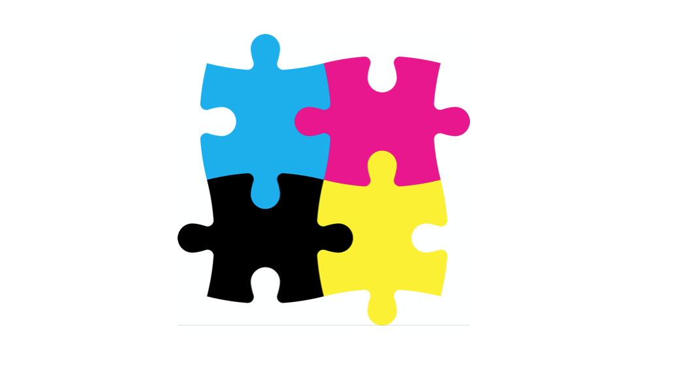

`Desarrollo Mobile` > `Swift Avanzado`

## Postwork

### OBJETIVO

- Poner a prueba los gestures vistos en clase.

#### REQUISITOS

1. Xcode 11

#### DESARROLLO

Por medio de gestures implementar una app que utilice cuatro imageviews (o más) y que permita armar un rompecabezas.

Cada pieza se deberá poder arrastrar (opcionalmente con una animación) y al entrar en contacto con una pieza deberá poder unirse.

