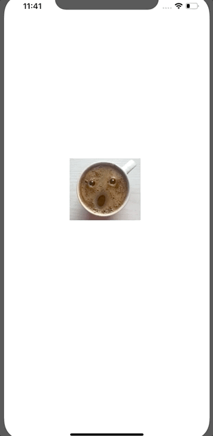

 
`Desarrollo Mobile` > `Swift Avanzado`

## Reto gesture animations

### OBJETIVO 

- Implementación de un `PanGesture`.

#### REQUISITOS 

1. Xcode 11

#### DESARROLLO

Utilizar `UIView` Animations en conjunto con Gestures.

Al arrastrar una imagen, esta debe de aumentar de tamaño.

Al soltar la imagen, debe de regresar a su tamaño original.



<details>
	<summary>Solucion</summary>
	<p> De igual forma que en los ejemplos y retos anteriores, en el UIImageView del Storyboard tenemos asociado un Gesture.</p>
	<p> Este gesture esta conectado a una función que tiene como parámetro un serder del tipo del gesture.</p>
	<p> Implementaremos en dicha función dos condiciones IF que detecten el inicio y fin del gesture.</p>
	<p>Dentro del IF que detecta el INICIO del gesture ejecutamos la función de escalamiento y animación.</p>
```
if recognizer.state == UIGestureRecognizer.State.began {
      scaleWithMove(scale: 1.5)
}
```
    <p>Dentro del IF que detecta el FIN del gesture ejecutamos la función de escalamiento para regresar al tamaño original.</p>
 
```
if recognizer.state == UIGestureRecognizer.State.ended {
      scaleWithMove(scale: 1.0)
    }
```
 <p>La función que se encarga de escalar y animar la imágen es: </p>
 
 ```
 private func scaleWithMove(scale: CGFloat) {
    UIView.animate(withDuration: 0.5, animations: { () -> Void in
      self.imageView?.transform = CGAffineTransform(scaleX: scale, y: scale)
    }, completion: nil )
  }
 ``` 

</details> 

