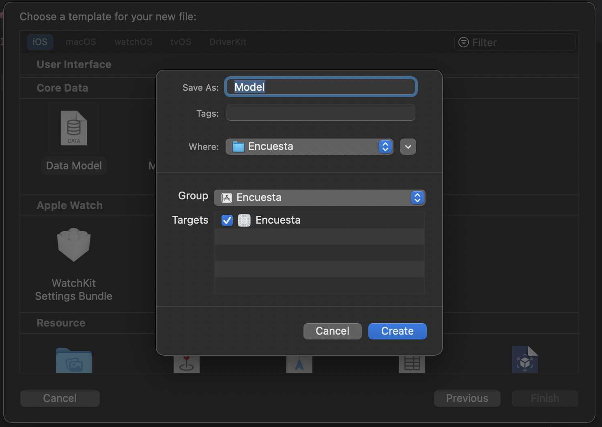
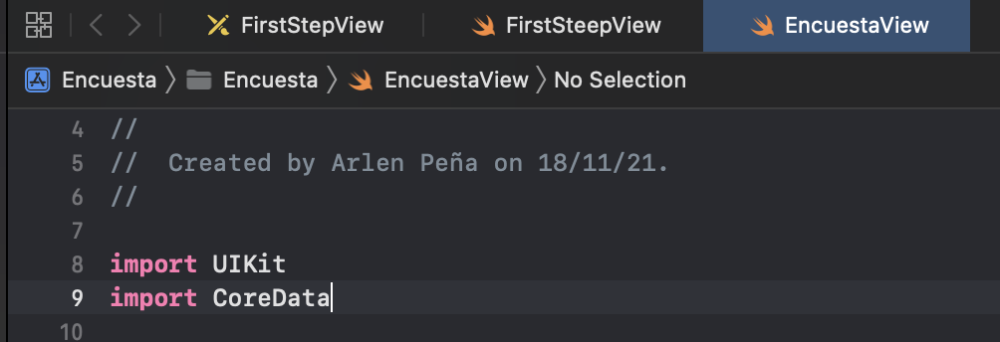
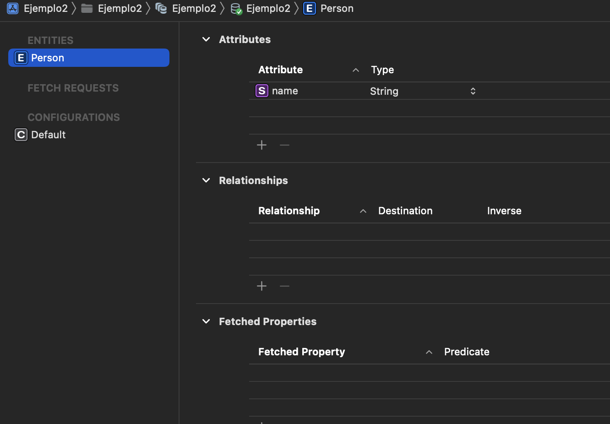

`Desarrollo Mobile` > `Swift Avanzado`

## Persistencia de Datos
##Ejemplo 1

### OBJETIVOS 

- Implementar Core Data en un proyecto que actualmente no lo tiene habilitado.

#### DESARROLLO

    En esta ejemplo estaremos trabajando con un proyecto ya creado en el cual, tendremos que implementar Core Data.
    
    Para su implementación puedes seguir los siguientes pasos:
    
- Paso1:  File->New->File->CoreData->DataModel->ColocarNombre
Nota este paso lo hemos visto antes en las notas del prework y puedes volver a consultarlo si te surge alguna duda.

- Paso2:  Estas Lineas de código permitirán que la app interactúe con el Core Data y solo hay que pegarlas al final del App Delegate.

    // MARK: - Core Data stack

    lazy var persistentContainer: NSPersistentContainer = {
        /*
         The persistent container for the application. This implementation
         creates and returns a container, having loaded the store for the
         application to it. This property is optional since there are legitimate
         error conditions that could cause the creation of the store to fail.
        */
        let container = NSPersistentContainer(name: “”NombreDeTuModeloDatos)
        container.loadPersistentStores(completionHandler: { (storeDescription, error) in
            if let error = error as NSError? {
                // Replace this implementation with code to handle the error appropriately.
                // fatalError() causes the application to generate a crash log and terminate. You should not use this function in a shipping application, although it may be useful during development.
                 
                /*
                 Typical reasons for an error here include:
                 * The parent directory does not exist, cannot be created, or disallows writing.
                 * The persistent store is not accessible, due to permissions or data protection when the device is locked.
                 * The device is out of space.
                 * The store could not be migrated to the current model version.
                 Check the error message to determine what the actual problem was.
                 */
                fatalError("Unresolved error \(error), \(error.userInfo)")
            }
        })
        return container
    }()

    // MARK: - Core Data Saving support

    func saveContext () {
        let context = persistentContainer.viewContext
        if context.hasChanges {
            do {
                try context.save()
            } catch {
                // Replace this implementation with code to handle the error appropriately.
                // fatalError() causes the application to generate a crash log and terminate. You should not use this function in a shipping application, although it may be useful during development.
                let nserror = error as NSError
                fatalError("Unresolved error \(nserror), \(nserror.userInfo)")
            }
        }
    }

- Paso3: colocar el import Core Data en nuestro View Controller y en el AppDelegate.

- Paso4. Crear la entidad necesario en este caso Person, con el atributo name de tipo String.

    
