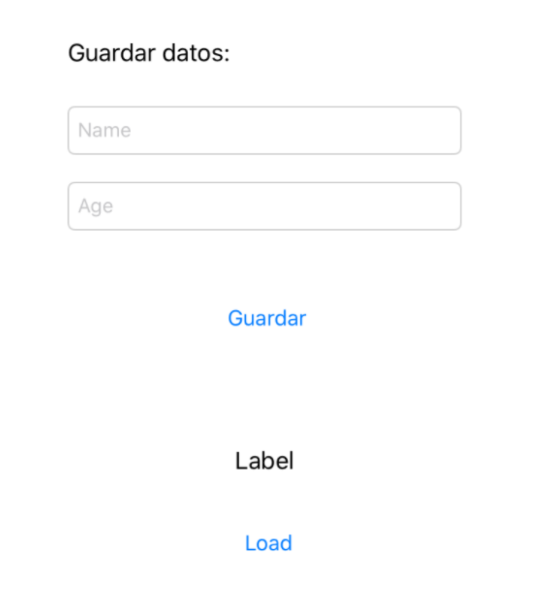

`Desarrollo Mobile` > `Swift Avanzado`

## Ejemplo 01, UserDefaults

### OBJETIVO

- Entender las diferencias entre CoreData y UserDefaults.

#### REQUISITOS

1. Xcode 11

#### DESARROLLO

1.- Crear una nueva app…

2.- Guardar mediante `User Defaults` dos tipos de datos:

- Uno numérico
- Uno de tipo String.

3.- Mediante un `UITextField` ingresaremos los datos y  con un `UIButton` guardaremos la información.

4.- Al volver ejecutar la app, mostraremos la info guardada en un `UILabel` al presionar el botón de `Load`.

