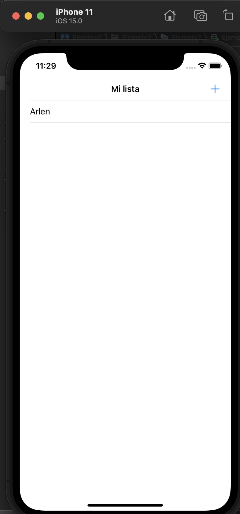

`Desarrollo Mobile` > `Swift Avanzado`

## Persistencia de Datos

### OBJETIVOS 
- Implementar funciones de Core Data para insertar elementos en nuestra app.

#### Desarrollo
- Para esta segundo ejemplo trabajaremos con el proyecto del ejemplo1 donde ya tenemos creado una entidad y  permite mostrar los elementos insertados mediante un input en una tabla.

- Creamos las entidades necesarias y realizaremos insert a las tablas.
Creamos un objeto con el nombre de tipo NSManagedObject : 
    var people: [NSManagedObject] = []
    
Sustituimos la variable 
'''
    self.names.append(nameToSave)
'''
por la funcion save 
'''
    self.save(name: nameToSave)
'''
La funcion save es la siguiente.
'''

          guard let appDelegate = UIApplication.shared.delegate as? AppDelegate else {return }
        // 1
          let managedContext = appDelegate.persistentContainer.viewContext
        // 2
          let entity = NSEntityDescription.entity(forEntityName: "Person",
                                       in: managedContext)!
          let person = NSManagedObject(entity: entity,
                                       insertInto: managedContext)
        // 3
          person.setValue(name, forKeyPath: "name")
        // 4
          do {
            try managedContext.save()
            people.append(person)
              print("person")
          } catch let error as NSError {
            print("Could not save. \(error), \(error.userInfo)")
          }
    }
'''

Ahora bien, hay un dato muy importante a considerar y es el flujo de vida de un storyboard,
te dejo como referencia esta liga (Ingles) por si tienes alguna duda.
https://medium.com/good-morning-swift/ios-view-controller-life-cycle-2a0f02e74ff5

Y bien considerando el ciclo de vida de los Storyboard, ¿Donde presentarias la información que estas solicitando al usuario en el input?

Te reto a que pruebes cada uno de los elementos del ciclo de vida del Storyboard y observes lo que sucede

'''
    override func viewDidAppear(_ animated: Bool) {
         super.viewDidAppear(animated)
       //1
         guard let appDelegate =
           UIApplication.shared.delegate as? AppDelegate else {
       return
       }
         let managedContext =
           appDelegate.persistentContainer.viewContext
       //2
         let fetchRequest =
           NSFetchRequest<NSManagedObject>(entityName: "Person")
       //3
         do {
           people = try managedContext.fetch(fetchRequest)
         } catch let error as NSError {
           print("Could not fetch. \(error), \(error.userInfo)")
         }
         print("mostar")
         myList.reloadData()
     }
     
'''

La solución completa puedes encontrarla en el directorio correspondiente al ejemplo 2.

Exito.

