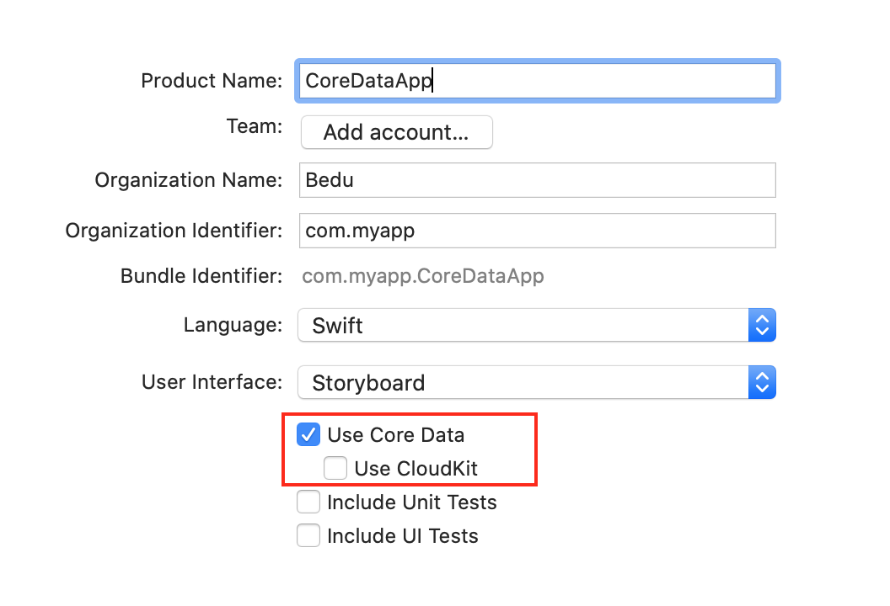
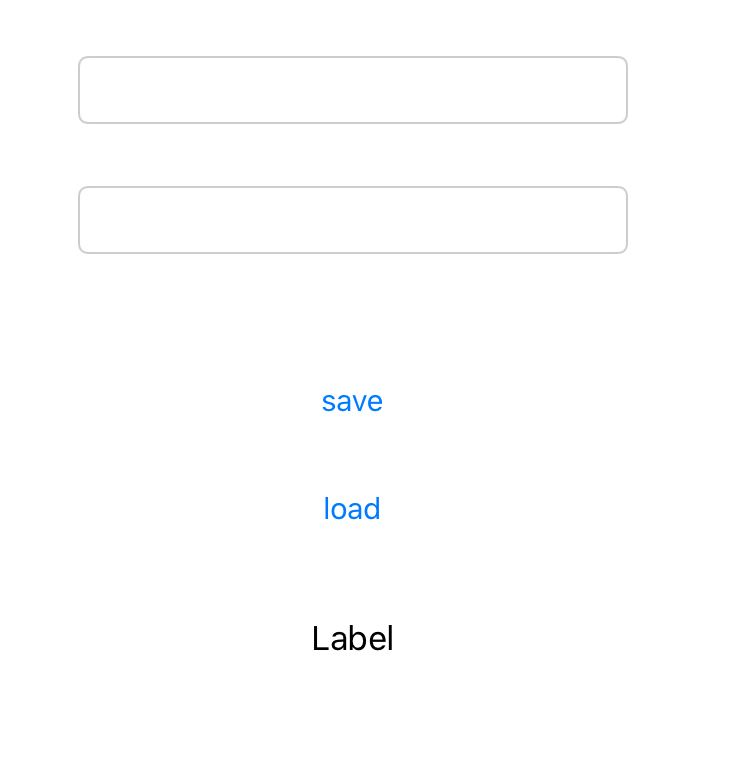

`Desarrollo Mobile` > `Swift Avanzado`

## Operaciones CRUD, creación y lectura.

### OBJETIVO

- Implementar las operaciones CRUD. Especificamente la operación de Creación y Lectura en CoreData.

#### REQUISITOS

1. Xcode 11

#### DESARROLLO

1.- Crearemos un nuevo proyecto, esta vez seleccionando la sig. opción.



2.- En la clase de DataManager implementaremos el sig. código:

```
    guard let appDelegate = UIApplication.shared.delegate as? AppDelegate else { return nil }
    let managedContext = appDelegate.persistentContainer.viewContext
    
    let fetchRequest = NSFetchRequest<NSFetchRequestResult> (entityName: "User")
    fetchRequest.fetchLimit = 1
```

Ya obenemos el objeto Data, ahora en el Viewcontroller usaremos esta función del DataManager.

```
  @IBAction func load(_ sender: Any) {
    guard let data = datamanager.retrieve() else { return }
    label.text = data.value(forKey: "email") as? String
  }
```
3.- El siguiente Layout debe implementarse:



4.- En los campos de texto agregaremos valores de email y password, el botón de Save guardará los datos. Y con Load mostraremos los datos almacenados en el Label.

