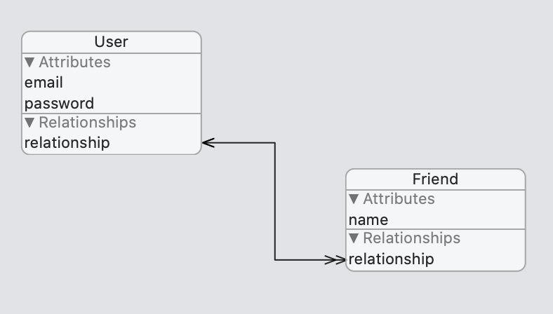

`Desarrollo Mobile` > `Swift Avanzado`


## Entities Relationships

### OBJETIVO

- Crear relaciones de tipo `1 a N` entre entidades.

#### REQUISITOS

1. Xcode 11

#### DESARROLLO

1.- Creamos un proyecto nuevo en Xcode con CoreData.

2.- Creamos una relación entre entidades, **User-Friends** es de tipo **1-N**.



3.- Los valores de cada **Entity** pueden variar, (como usar email y password).

4.- Haremos dos relaciones, Una de 1-N y una de reversa que sera 1-1.

5.- Para poder utilizar las entidades hacemos una referencia al managedContext.

```
guard let appDelegate = UIApplication.shared.delegate as? AppDelegate else { return }
let managedContext = appDelegate.persistentContainer.viewContext
```

6.- Creamos dos instancias, una para user y otra para friend.
```
    guard let entityUser = NSEntityDescription.entity(forEntityName: "User", in: managedContext),
      let entityFriend = NSEntityDescription.entity(forEntityName: "Friend", in: managedContext) else { return }
```

7.- Agregamos valores.

```
    entityUser.setValue("MyName", forKey: "name")
    entityFriend.setValue("FriendName", forKey: "name")
```

8.-  Y creamos una relación.

```
    //Create relation
    entityUser.setValue(entityFriend, forKey: "myFriends")
    do {
      try managedContext.save()
    } catch { }
```


