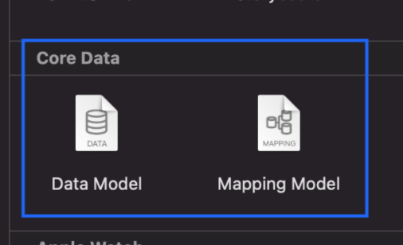
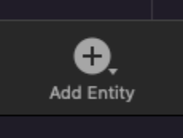
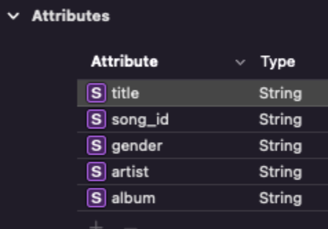
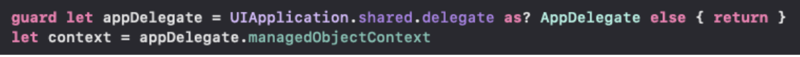
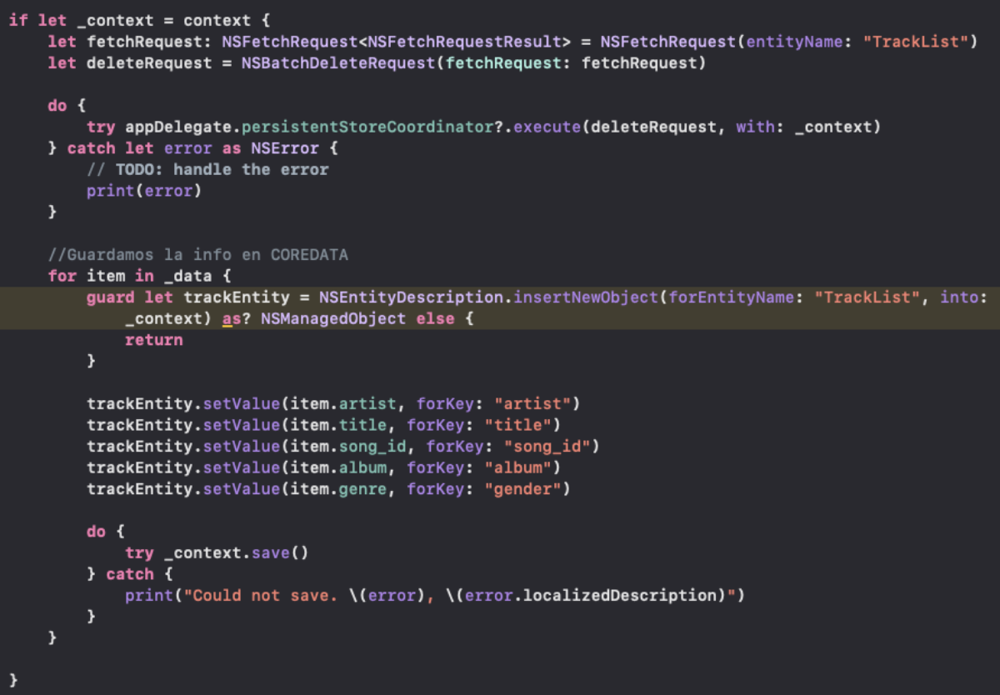
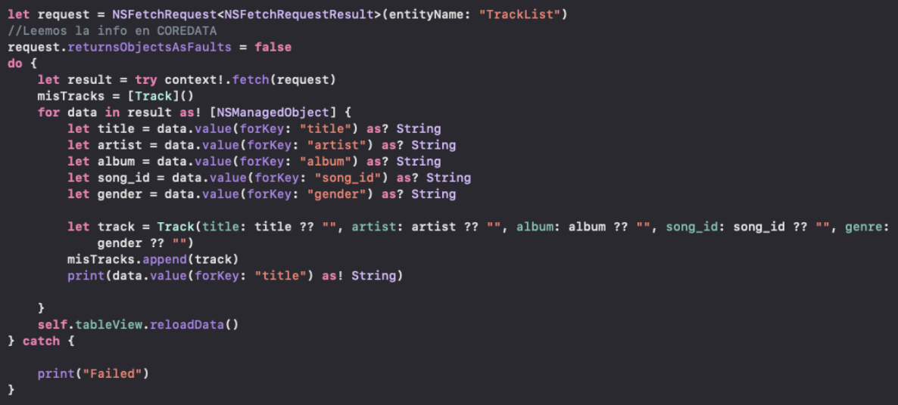

# Sesión #8: Persistencia de datos

## :dart: Objetivos

- Generar un modelo en CoreData.
- Crear un Entity donde guardaremos la información.
- Guardar info en nuestra entidad.
- Acceder a la info y usarla

## ⚙ Requisitos

+ Sesiones anteriores
+ Codigo de la sesion anterior

## Desarrollo

Al contar con el proyecto ya creado, agregar el modelo de CoreData.
Crear la entidad donde guardaremos la lista de canciones
Sumar al AppDelegate las opciones necesarias para el funcionamiento correcto de nuestra Base de datos.
Crear la función para guardar la información que viene desde el servicio.
Borrar la información de la entidad para no duplicar
Usar la información de la BD en caso de tener algún error en la BD

Como ya vimos, Swift nos ofrece una muy potente Base de datos, la cual nos ayuda a mantener la información de forma segura en nuestra aplicación, en el caso de nuestro proyecto podemos usarla para guardar el listado de canciones que descargamos desde el servicio.
Como primer punto necesitamos agregar CoreData a nuestro proyecto, esto lo hacemos tal como agregamos un archivo, ahi buscaremos la opción de CoreData y usaremos el Data model

Para este caso lo nombramos Model, esto nos ayudará a ubicarlo y a las configuraciones necesarias en el AppDelegate
Ya tenemos nuestro modelo de datos, ahora necesitamos la entidad donde guardaremos la información, esto es lo mismo a las tablas en otras bases de datos, ubicamos este botón:

Por default el nombre será Entity, nosotros lo podremos cambiar a nuestro gusto, para efecto de nuestro Postwork será TrackList, una vez hecho esto asignaremos los atributos quedando de esta manera:

En nuestro caso todos los elementos son String, pero tenemos gran diversidad de tipos de datos.
Como siguiente paso incluiremos la configuración requerida en nuestro AppDelegate, este paso es parte de lo complejo debido a que tenemos nuestro objeto creado con anterioridad sin CoreData, básicamente estas son las opciones que necesitamos para su correcto uso, pon atención a los apartados destacados que son donde deberás cambiar los nombres del modelo en caso que lo hayas nombrado distinto:

// MARK: - Core Data stack
    lazy var persistentContainer: NSPersistentContainer = {
        /*
        The persistent container for the application. This implementation
        creates and returns a container, having loaded the store for the
        application to it. This property is optional since there are legitimate
        error conditions that could cause the creation of the store to fail.
        */
        let container = NSPersistentContainer(name: "Model")
        container.loadPersistentStores(completionHandler: { (storeDescription, error) in
            if let error = error as NSError? {
                // Replace this implementation with code to handle the error appropriately.
                // fatalError() causes the application to generate a crash log and terminate. You should not use this function in a shipping application, although it may be useful during development.
                   
                /*
                Typical reasons for an error here include:
                * The parent directory does not exist, cannot be created, or disallows writing.
                * The persistent store is not accessible, due to permissions or data protection when the device is locked.
                * The device is out of space.
                * The store could not be migrated to the current model version.
                Check the error message to determine what the actual problem was.
                */
                fatalError("Unresolved error \(error), \(error.userInfo)")
            }
        })
        return container
    }()

    // MARK: - Core Data Saving support
    func saveContext () {
        let context = persistentContainer.viewContext
        if context.hasChanges {
            do {
                try context.save()
            } catch {
                // Replace this implementation with code to handle the error appropriately.
                // fatalError() causes the application to generate a crash log and terminate. You should not use this function in a shipping application, although it may be useful during development.
                let nserror = error as NSError
                fatalError("Unresolved error \(nserror), \(nserror.userInfo)")
            }
        }
    }
    
    
    lazy var applicationDocumentsDirectory: NSURL = {
        // The directory the application uses to store the Core Data store file. This code uses a directory named "com.jqsoftware.MyLog" in the application's documents Application Support directory.
        let urls = FileManager.default.urls(for: .documentDirectory, in: .userDomainMask)
        return urls[urls.count-1] as NSURL
    }()
    
    
    lazy var managedObjectModel: NSManagedObjectModel = {
        // The managed object model for the application. This property is not optional. It is a fatal error for the application not to be able to find and load its model.
        let modelURL = Bundle.main.url(forResource: "Model", withExtension: "momd")!
        return NSManagedObjectModel(contentsOf: modelURL)!
    }()
    
    
    lazy var persistentStoreCoordinator: NSPersistentStoreCoordinator? = {
        var coordinator: NSPersistentStoreCoordinator? = NSPersistentStoreCoordinator(managedObjectModel: self.managedObjectModel)
        let url = self.applicationDocumentsDirectory.appendingPathComponent("Model.sqlite")
        var error: NSError? = nil
        var failureReason = "There was an error creating or loading the application's saved data."
        let mOptions = [NSMigratePersistentStoresAutomaticallyOption: true, NSInferMappingModelAutomaticallyOption: true]
        do {
            try coordinator!.addPersistentStore(ofType: NSSQLiteStoreType, configurationName: nil, at: url, options: mOptions)
        } catch {
        }
        
        return coordinator
    }()
    
    
    
    lazy var managedObjectContext: NSManagedObjectContext? = {
        // Returns the managed object context for the application (which is already bound to the persistent store coordinator for the application.) This property is optional since there are legitimate error conditions that could cause the creation of the context to fail.
        let coordinator = self.persistentStoreCoordinator
        if coordinator == nil {
            return nil
        }
        var managedObjectContext = NSManagedObjectContext.init(concurrencyType: .mainQueueConcurrencyType)
        managedObjectContext.persistentStoreCoordinator = coordinator
        return managedObjectContext
    }()

Uff, eso es bastante configuración en nuestro AppDelegate, pero necesaria para facilitar nuestra interacción con la BD, ahora sigamos con lo interesante, ¿cómo guardamos los datos?
¿Recuerdas que al momento de mostrar la lista de canciones mandamos llamar un servicio? Ese es el lugar ideal para guardar la información e incluso cargarla:

Para este punto primero necesitamos instanciar nuestro contexto

Con esto, podemos facilitar el guardado de datos

Toma en cuenta que esto lo estamos haciendo una vez que nos respondió el servicio y contamos con la información, en la imagen puedes ver las primeras líneas haciendo referencia al eliminado de los datos de nuestra entidad, esto para que no dupliquemos la información, con esto ya podemos guardar en CoreData
¿Qué pasa si llega a fallar el servicio pero afortunadamente guardamos la información?
Para ese escenario necesitamos obtener la info que tenemos en la Base de datos, justo antes de invocar nuestro servicio:

Con esto obtenemos la información con la que contamos en la BD, destaquemos que en caso de guardar valores nulos necesitamos mapear correctamente en nuestro objeto a guardar
Listo, con esto estamos listos para mostrar la información de la lista de canciones, con todo esto tu app incluso se puede volver offline si así lo prefieres

