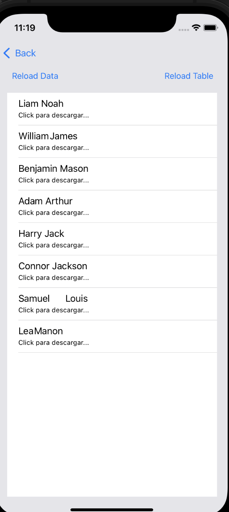
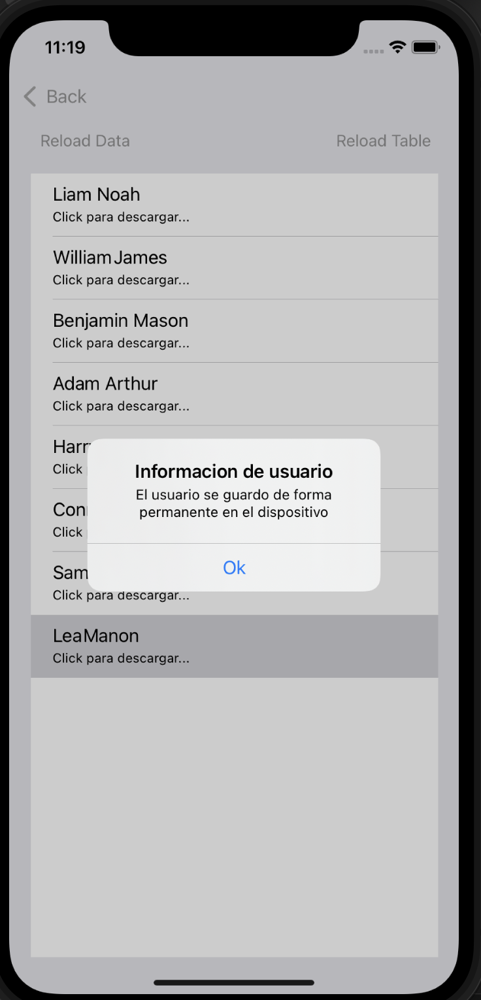
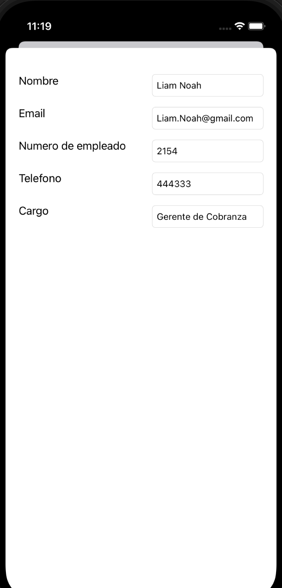

`Desarrollo Mobile` > `Swift Avanzado`

## Reto2

### OBJETIVOS 

- Almacenar datos de tipo numérico, de tipo bool, String hasta objetos.
- Conocer las distintas formas de almacenar datos de manera local en una App.
- Implementar modelos Entidad-Relación en Core data.

 
#### DESARROLLO
Como seguramente en sesiones pasadas, has implementado servicios  y concurrencia, vamos a unirlo con los conceptos que hasta ahora ya conoces de Core Data.

En este reto se tendra un servicio que tendras que consultar y permitir que el usuario visualize el contenido del servicio en la app, y permitir que almacene dicha informacón en el dispositivo con CoreData.

Servicio:
https://bedu-swift.herokuapp.com/cobranza.php

En este Reto tenemos la siguiente pantalla:

Donde únicamente contamos con una tabla y un botón con el texto “Consultar Online”

Al dar clic mostrará la segunda pantalla que con 2 botones Reload Data y reload Table.

ReloadData, cargará los datos del servicio antes mendionado, para posteriormente seleccionar Reload Table y mostrar en pantalla la información del servicio.

Al seleccionar uno de los elementos de la tabla mostrará un alerta, donde informa que se ha cargado la información del usuario y es aquí donde se implementa CoreData, ya que la información cargada del usuario seleccionado ahora se deberá almacenar en el dispositivo, al dar Back o regresar, se muestra la tabla con la información del elemento que seleccionamos.

Al seleccionar el elemento de la pantalla principal despliega la siguiente información:

Nombre 
Email
Num empleado
Telefono
Cargo

Si tienes alguna duda de como implementar algunas funciones o las entidades puedes consultar el proyecto en el directorio correspondiente al Reto 2.

Exito.
