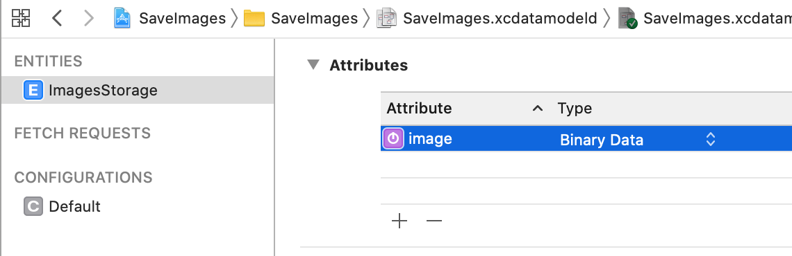
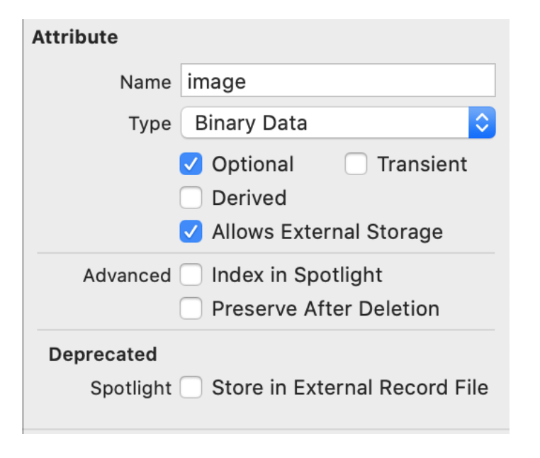

 
`Desarrollo Mobile` > `Swift Avanzado`

## Almacenamiento de imagenes 

### OBJETIVO 

- Implementar una App con un Entity que permita almacenamiento de imagenes en el local storage.

#### REQUISITOS 

1. Xcode 11 

#### DESARROLLO

1.- Crear una App con Core Data.

2.- Nos dirigimos a los entities de CoreData y creamos un Entity para almacenar las imagenes.

3.- Este entity tendra un atributo de tipo `Binary Data`.



4.- Además, para almacenar en el local storage activamos el checkbox:



<details>
	<summary>Solución</summary>
<p> Comenzamos creando una referencia al persistentContainer.</p>

```
guard let appDelegate = UIApplication.shared.delegate as? AppDelegate else { return }
let context = appDelegate.persistentContainer.viewContext
```
<p>  Luego, agregamos una imagen de nuestro agrado, puede estar en el Assests. Y le aplicamos la funcion pngData() para obetner sus datos binarios. </p>
    
```
let imageData = UIImage().pngData()
```

<p> Procedemos a Guardar la imagen en el Entity</p>

```
guard let imageEntity = NSEntityDescription.insertNewObject(forEntityName: "ImagesStorage", into: context) as? NSManagedObject else { return }
imageEntity.setValue(imageData, forKey: "image")
do {
      try context.save()
    } catch { }
  }
```
</details> 
